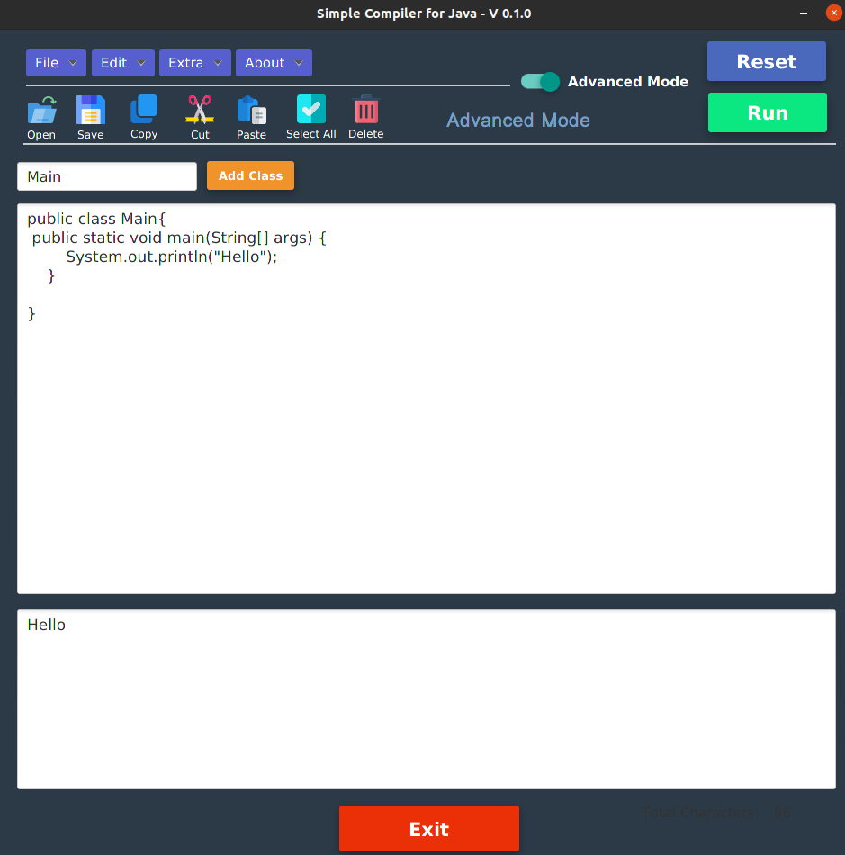
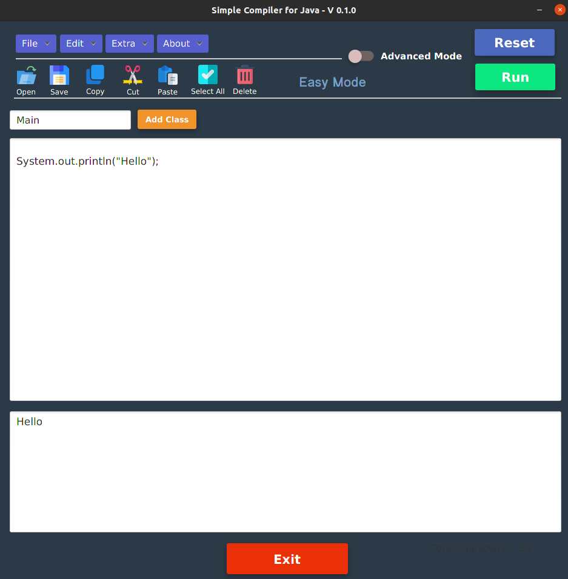

# About Simple Compiler for JAVA - V 0.1.0

## Introduction with Objective of Develop the Program

Here introduce a simple compiler of the Java programming language as mentioned in the application name. It can compile and run valid java code with both compilation and run are done with a single button. The application is powered with Java programming language techniques with the JavaFX library.

This application is developed to get hands-on skills in Java programming language with JavaFX library. Here especially emphasized Process handling and I/O operation of Java programming language.

;
;

## Functioning

Especially here embedded two modes as Easy and Advanced. When you stay in Easy Mode, it is unnecessary to add conventional code blocks as the class name and the main method. Those will automatically be added when the compile stage.

If you select Advance mode, it should be input the code data as it is Java syntax. In both modes, your preferred name of the main class is inserted through a given text field at the program interface.

Conventional menu buttons, basic typesetting commands (copy, paste, select all ….), and single buttons for quick access of menu button settings are also embedded for ensuring the basic file-handle process.

## License

The program is licensed under [MIT] license.

Copyright © Thanura Silva 2021 - Present - All Rights Reserved
